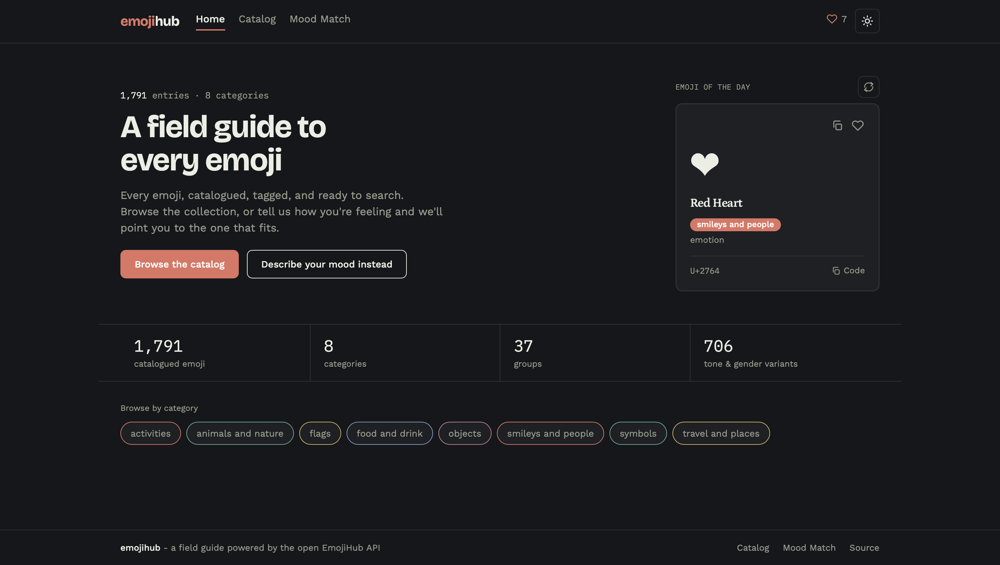
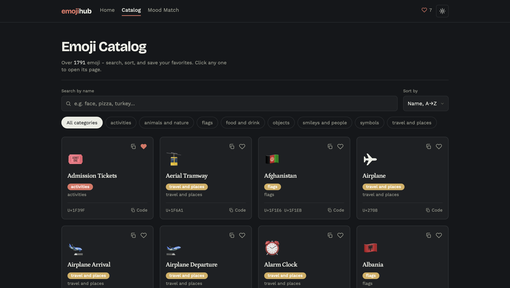
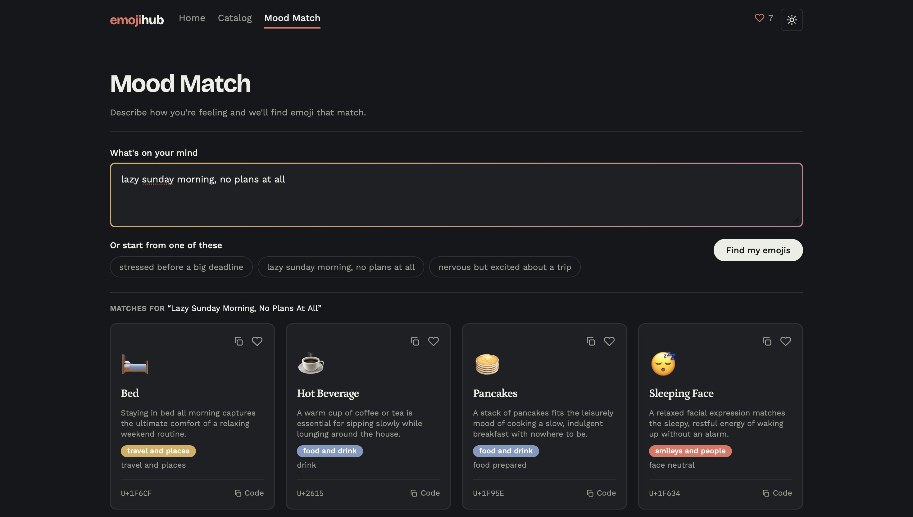

# Emoji Hub

A full-stack emoji explorer built on top of the [EmojiHub](https://emojihub.yurace.pro/) API: browse and search emoji, view details with an LLM-generated mood description, save favorites, and find matching emoji for a piece of text via **Mood Match**.

Live: [xlz-emojihub.vercel.app](https://xlz-emojihub.vercel.app)

The frontend talks to a separately deployed backend API on Render: [emoji-hub-backend-yaw0.onrender.com](https://emoji-hub-backend-yaw0.onrender.com). It runs on a free tier and spins down when idle, so the first request after a while can take up to a minute to wake up.

## Screenshots







## Getting started

### Backend

```bash
cd backend
cp .env.example .env   # or export the vars below manually
./gradlew bootRun
```

Environment variables (all have working defaults except the Gemini key):

| Variable | Default | Notes |
|---|---|---|
| `GEMINI_API_KEY` | (empty) | required for mood description and Mood Match; the rest of the app works without it |
| `ALLOWED_ORIGIN` | `http://localhost:5173` | frontend origin for CORS |
| `EMOJIHUB_BASE_URL` | `https://emojihub.yurace.pro/api` | |
| `PORT` | `8080` | |

### Frontend

```bash
cd frontend
cp .env.example .env.local
npm install
npm run dev
```

```
VITE_API_BASE_URL=http://localhost:8080
```

## How it was built

Development went in vertical slices: each slice shipped a full feature end to end (backend + frontend) instead of building all of the backend first. Both skeletons were deployed on day one, before any business logic, specifically to catch CORS/Docker/hosting issues early rather than late.

## Notable decisions

- **Slug = `name + category`, not just `name`.** EmojiHub has no stable `id`, and there's a real name collision in the dataset (`"turkey"`: the animal and the flag, in different categories). Slugifying both fields avoids this without needing to special-case anything.
- **HTML entities decoded server-side.** EmojiHub returns emoji as HTML numeric character references (`&#128512;`), not raw unicode. The backend decodes them once, so the frontend just renders plain strings, no `dangerouslySetInnerHTML` anywhere.
- **Emoji catalog cache is warmed eagerly, not lazily.** It's loaded into memory on startup (before the server opens its port) and refreshed on a schedule in the background, instead of being filled on first request. A lazy cache meant the first requests after a Render cold start went straight to the external API in parallel, and some of them timed out. The eager version means normal requests never touch the network at all.
- **Mood Match** is the one feature beyond the spec: instead of describing an emoji's mood, it goes the other way, you describe a mood or situation in free text, and an LLM call picks matching emoji with a short reason for each.

## Trade-offs

- **localStorage instead of a database/auth**: favorites don't need to survive a re-install or sync across devices for this scope.
- **In-memory caching instead of Redis**: single instance, no need for a shared cache.
- **In-memory rate limiting instead of a distributed one**: same reason, and it's enough to protect the free-tier Gemini quota.
- **Client-side "Load more" instead of server pagination**: the full emoji list is already cached in memory; paginating server-side would add complexity without a real benefit here.
- **Render free tier instead of a paid host**: acceptable for a project like this, the cold-start trade-off is called out above.

## Known limitations

- Backend cold start on Render's free tier (first request can be slow).
- Gemini free tier has request limits, mitigated by caching mood responses per slug, but not unlimited.
- Favorites live in `localStorage`, so they don't sync across devices/browsers.
- A handful of emoji names contain unusual characters. That's how EmojiHub's source data is, not a bug in this app.

## Tech stack

**Backend: Spring Boot 4 (Java 21), Gradle.** `RestClient` for outbound calls to EmojiHub and Gemini. The emoji catalog lives in an eager in-memory snapshot (warmed on startup, refreshed on a schedule); Gemini's mood responses are cached separately with Caffeine, since they're keyed by slug and don't need refreshing. No database was needed given the scope.

**Frontend: Vite + React + TypeScript, Tailwind v4.** Data fetching is a thin `fetch` wrapper rather than React Query/SWR: every request is used in exactly one place, there's no cross-component cache-sharing need, and the backend already caches the underlying data, a fetching library would add abstraction without solving a real problem here. Catalog state (search/sort/category) lives in the URL via `useSearchParams` rather than component state, so filters survive a refresh or a shared link.
